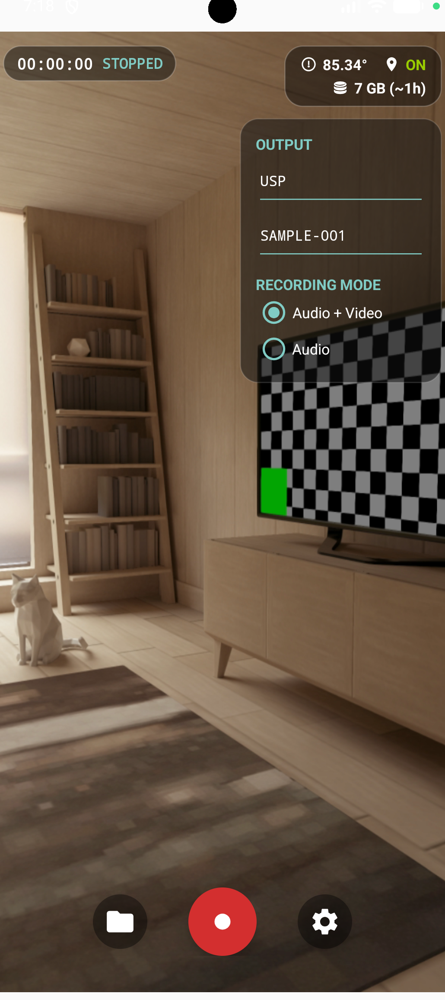
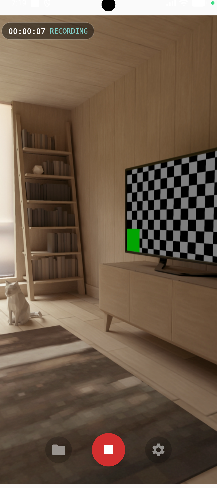
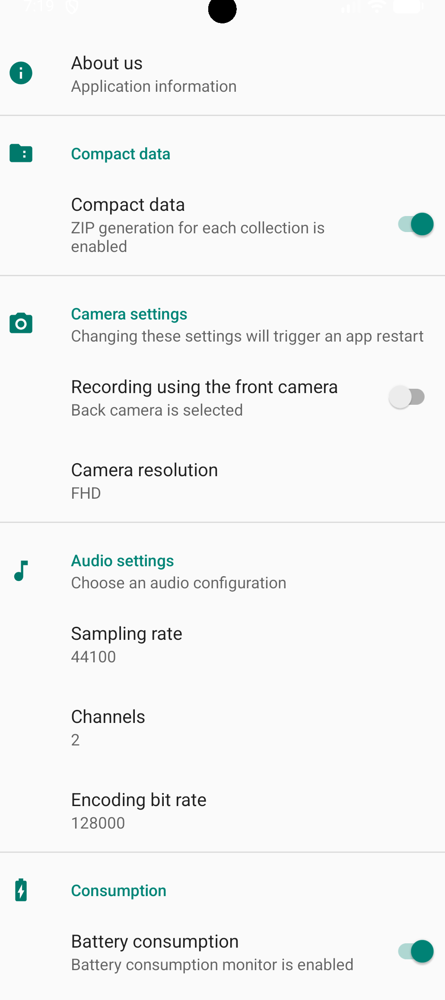
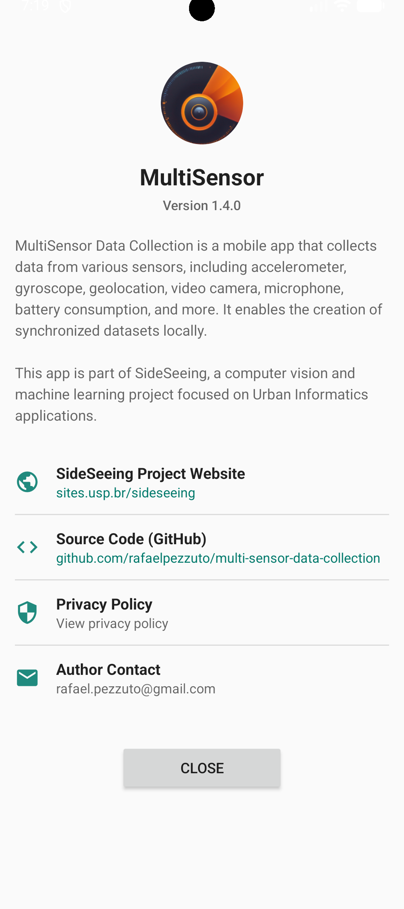
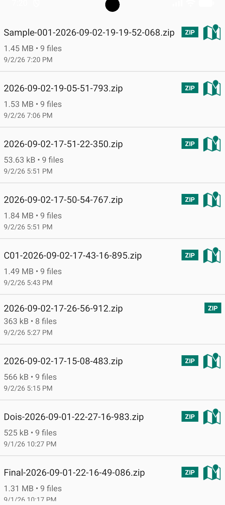
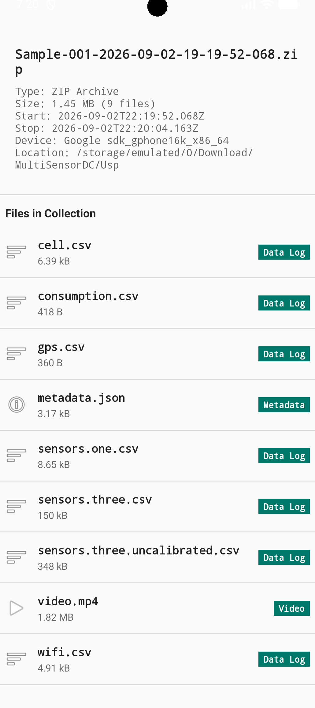
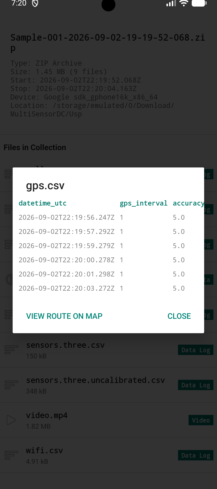

# MultiSensor Data Collection

MultiSensor Data Collection is an open-source Android application designed for high-precision, multi-sensor dataset acquisition. The application synchronously records and structures local data from mobile sensors—including video camera, microphone, accelerometer, gyroscope, magnetometer, gravity, light, geolocation (GPS), battery consumption, and network signals—producing synchronized multimodal datasets for urban informatics, computer vision, and machine learning research.

---

## Features

- **Synchronized Video & Audio Recording**: High-definition video recording (SD, HD, FHD, 4K) via Jetpack CameraX with configurable frame rates, audio sampling rates, and channels.
- **Camera Pinch-to-Zoom**: Dynamic gesture zoom control with bounded zoom ratios.
- **Multi-Sensor Logging**: High-frequency logging for motion sensors (accelerometer, gyroscope, magnetometer, gravity), light, pressure, and step counters.
- **Geolocation Tracking**: High-accuracy GPS tracking (`gps.csv`) paired with an in-app interactive map (OpenStreetMap) displaying route polylines, departure/arrival markers, and timestamp/accuracy metadata.
- **Data History & In-App Inspection**:
  - **Dataset List**: Local collection management for ZIP archives and uncompressed directories.
  - **Media Player**: Full-screen video and audio player.
  - **CSV Inspector**: Scrollable table view for sensor CSV files with highlighted headers.
  - **JSON Inspector**: Formatted view for metadata JSON files.
- **Real-Time Disk Space & Recording Estimation**: Live storage monitoring with dynamic recording time estimation based on selected resolution and audio/video mode.
- **Battery & Network Diagnostics**: Periodic logging of battery consumption metrics and Wi-Fi / Cellular network scans.

---

## Screenshots

|  |  |
|:---:|:---:|
| **Main Interface (Idle)** | **Main Interface (Recording)** |

|  |  |
|:---:|:---:|
| **Settings Screen** | **About Screen** |

|  |  |
|:---:|:---:|
| **Saved Data History** | **Collection Details** |

|  |
|:---:|
| **CSV Data Inspection** |

---

## Dataset Structure

Each collection run produces a structured dataset directory (or `.zip` archive) formatted as follows:

```text
MultiSensorDC/<dataset_name>/
├── video.mp4               # Synchronized video stream
├── audio.m4a               # Audio recording (in audio-only mode)
├── metadata.json           # System metadata, sensor parameters, and UTC timestamps
├── accelerometer.csv       # timestamp_utc, timestamp_nanos, x, y, z
├── gyroscope.csv           # timestamp_utc, timestamp_nanos, x, y, z
├── magnetometer.csv        # timestamp_utc, timestamp_nanos, x, y, z
├── gravity.csv             # timestamp_utc, timestamp_nanos, x, y, z
├── gps.csv                 # datetime_utc, gps_interval, accuracy, latitude, longitude
├── battery.csv             # timestamp_utc, battery_level, temperature, voltage
└── network.csv             # timestamp_utc, wifi_ssid, bssid, rssi, cellular_info
```

---

## Building and Installation

### Requirements
- **JDK**: 21
- **Android SDK**: Target SDK 36 (Android 15+), Min SDK 26 (Android 8.0+)
- **Gradle**: 9.5+ with Version Catalog (`gradle/libs.versions.toml`)

### Compilation Commands

```bash
# Build Debug APK
./gradlew app:assembleDebug

# Execute Unit Tests
./gradlew app:testDebugUnitTest

# Build Release App Bundle (AAB)
./gradlew app:bundleRelease
```

---

## Research Context: SideSeeing Project

This application is developed as part of the **SideSeeing Project** at the **Institute of Mathematics and Statistics of the University of São Paulo (IME-USP)**.

SideSeeing investigates computer vision, sensor fusion, and machine learning methods for Urban Informatics, focusing on urban accessibility, sidewalk quality, and infrastructure assessment.

For further details regarding the research initiative, visit [SideSeeing Project](https://sites.usp.br/sideseeing).

---

## Authors and Citation

- **Alyssa Florence** / IME-USP
- **Rafael Jeferson Pezzuto Damaceno** / IME-USP (*rafael.pezzuto@gmail.com*)
- **Roberto Marcondes Cesar Jr.** / IME-USP
